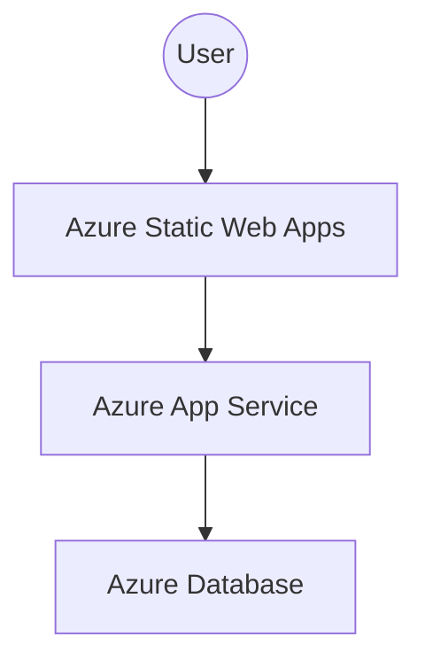

# Azure Deployment Plan for Todo Solution

This deployment plan is tailored for your project structure:

- **Backend:** Java Spring Boot (in `todo-backend/`)
- **Frontend:** React (in `todo-frontend/`)

---

## 1. Backend (`todo-backend/`) on Azure App Service

- **Build your Spring Boot JAR**
    - From the root, run:  
      `cd todo-backend && ./mvnw clean package`  
      or  
      `cd todo-backend && mvn clean package`
    - Output: `todo-backend/target/*.jar`
- **Provision Azure App Service**
    - Use Java 17+ (match your local dev environment if possible)
    - In Azure Portal, create a Web App (Java SE, Linux recommended for cost and performance)
- **Deploy to App Service**
    - Upload the built JAR file using Azure Portal, Azure CLI, or set up GitHub Actions for automatic deploys
- **Database Setup (if needed)**
    - Provision Azure Database for MySQL/PostgreSQL (choose based on your app's current config)
    - Update `todo-backend/src/main/resources/application.properties` with Azure connection strings, or set them as environment variables in the App Service’s "Configuration" tab
- **CORS Configuration**
    - Ensure your backend's CORS settings allow origins from your frontend Static Web App domain

---

## 2. Frontend (`todo-frontend/`) on Azure Static Web Apps

- **API Endpoint Setup**
    - Ensure your React app points to the Azure backend URL  
      (Edit `todo-frontend/.env` or any API base URL in the source)
    - Example:  
      `REACT_APP_API_URL=https://<your-backend-app-name>.azurewebsites.net`
- **Build**
    - From the root:  
      `cd todo-frontend && npm install && npm run build`
    - Output: `todo-frontend/build/`
- **Provision Azure Static Web App**
    - In Azure Portal, create a Static Web App and link your GitHub repository for CI/CD, or upload the `build/` output directly
    - Set the "app artifact location" to `todo-frontend/build`
- **CI/CD Integration**
    - Recommend linking your GitHub repo so pushes to `main` branch trigger automatic builds/deploys
- **Environment Variables/CORS**
    - Configure environment variables for the frontend (like API URLs) using the Azure Portal Static Web Apps configuration section
    - Update backend CORS to allow requests from your frontend’s Azure Static Web App domain
- **Custom Domain/HTTPS**
    - Configure as needed in Azure Portal

---

## 3. CI/CD (Recommended)

- Set up GitHub Actions for both `todo-backend` and `todo-frontend`
    - Backend: On push to main, build and deploy JAR to Azure App Service
    - Frontend: On push to main, build and deploy React app to Azure Static Web Apps

---

## 4. Deployment Diagram

---

## 5. Final Notes & Tips

- Reference these actual repo folders: `todo-backend/`, `todo-backend/src/main/resources/application.properties`, `todo-frontend/`
- Database and sensitive backend configs should be set as Azure App Service environment variables (not hardcoded in source)
- If using a custom domain, configure both App Service and Static Web Apps domains in Azure Portal
- Regularly test CORS, endpoint URLs, and env variables after Azure deploys

---

**Follow this customized setup for smooth Azure deployment. For comparisons with other cloud providers, see `deployment-options-comparison.md`.**
