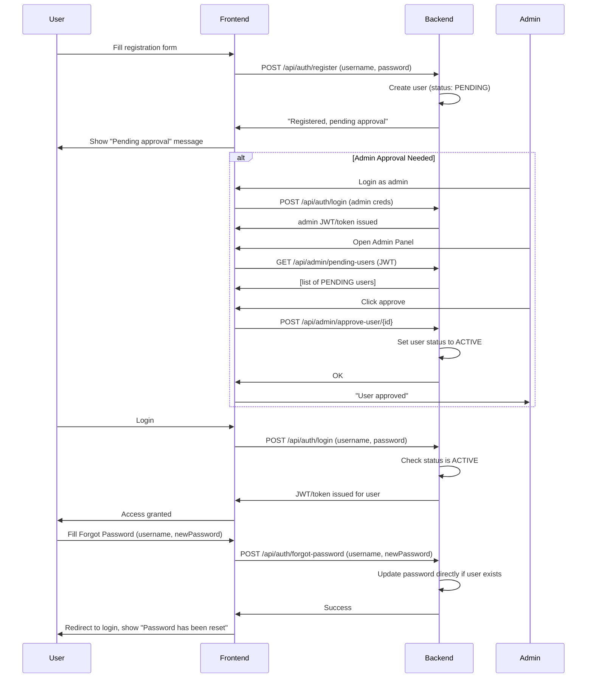
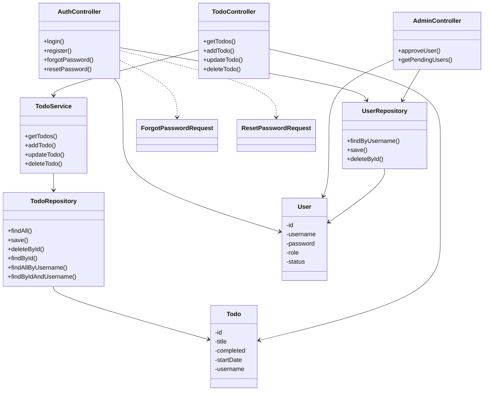

# Application Flow Diagram

This diagram illustrates the flow between the layers of the Todo application, from the UI through the backend to MSSQL.

---

## User & Admin Flows

### Registration, Approval, Login, and Password Reset

### Notes

- **SQL Server required** for backend in all environments.
- Default admin user created if not present in MSSQL DB.
- Normal users must be approved by admin before login.
- After password reset, redirect to login and show "Password has been reset" message.

### Admin Panel and Auth Endpoints

- **/api/auth/register**: New user registered as "PENDING"
- **/api/admin/pending-users**: Admin gets list of pending users
- **/api/admin/approve-user/{id}**: Admin approves user ("ACTIVE")
- **/api/auth/login**: User or admin login (status must be ACTIVE)
- **/api/auth/forgot-password**: User directly resets password (username & newPassword; no email/token required)

---

## UML Class Diagram

---

> **Note:**
> - Password reset is direct: users reset their password on the Forgot Password page by providing their username and new password, with no token or email involved.
> - After successful reset, users are redirected to the login page and see a "Password has been reset" message.
> - All admin/user control flows (including approval and pending user list) are accessible from the Admin Panel in the UI.

---

## Testing & CI/CD

- **Unit** and **integration tests** are present and require an accessible SQL Server.
- **All GitHub Actions pipelines are currently commented out** - see `.github/workflows/`.

---

For detailed API usage and environment setup, see `README.md` (now fully up-to-date with these flows).
