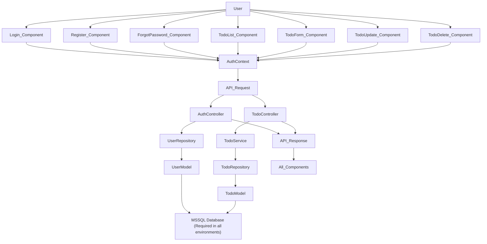

# Application Flow Diagram

This diagram illustrates the flow between the layers of the Todo application, from the UI through the backend to MSSQL.

---

## High-Level Flow



### Notes

- **SQL Server required** for backend in all environments.
- Default admin user created if not present in MSSQL DB.

### Admin Approval & Password Reset

- **/api/auth/register**: New user registered as "PENDING"
- **/api/auth/approve/{username}**: Admin approves user ("ACTIVE")
- **/api/auth/forgot-password**: Initiates password reset, returns token
- **/api/auth/reset-password**: Resets password using token

---

## UML Class Diagram

```mermaid
classDiagram
    class AuthController {
      +login()
      +register()
      +approveUser()
      +forgotPassword()
      +resetPassword()
    }
    class TodoController {
      +getTodos()
      +addTodo()
      +updateTodo()
      +deleteTodo()
    }
    class TodoService {
      +getTodos()
      +addTodo()
      +updateTodo()
      +deleteTodo()
    }
    class TodoRepository {
      +findAll()
      +save()
      +deleteById()
      +findById()
      +findAllByUsername()
      +findByIdAndUsername()
    }
    class UserRepository {
      +findByUsername()
      +save()
      +deleteById()
    }
    class Todo {
      -id
      -title
      -completed
      -startDate
      -username
    }
    class User {
      -id
      -username
      -password
      -role
      -status
    }

    AuthController --> UserRepository
    AuthController --> User
    TodoController --> TodoService
    TodoService --> TodoRepository
    TodoRepository --> Todo
    TodoController --> Todo
    UserRepository --> User

    %% Extra relationships for admin and password reset flows
    AuthController ..> "ForgotPasswordRequest"
    AuthController ..> "ResetPasswordRequest"
```

---

## Testing & CI/CD

- **Unit** and **integration tests** are present and require an accessible SQL Server.
- **All GitHub Actions pipelines are currently commented out** - see `.github/workflows/`.

---

For detailed API usage and environment setup, see `README.md`.
