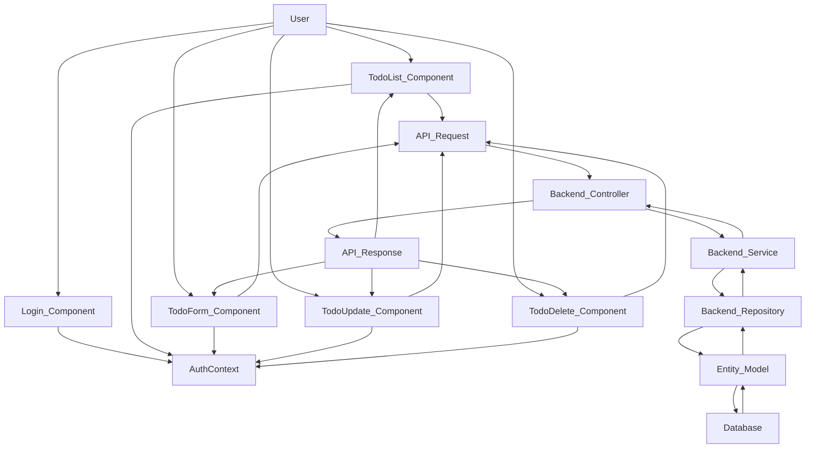
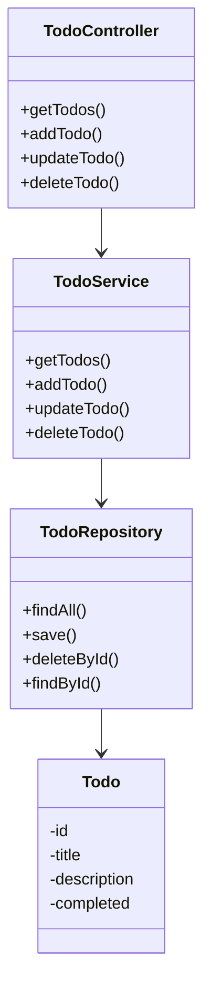

# Application Flow Diagram

This diagram illustrates the flow between the layers of the Todo application, from the user interface through the backend to the database.

```mermaid
flowchart TD
User --> Login_Component
User --> TodoList_Component
User --> TodoForm_Component
User --> TodoUpdate_Component
User --> TodoDelete_Component

Login_Component --> AuthContext
TodoList_Component --> AuthContext
TodoForm_Component --> AuthContext
TodoUpdate_Component --> AuthContext
TodoDelete_Component --> AuthContext

TodoList_Component --> API_Request
TodoForm_Component --> API_Request
TodoUpdate_Component --> API_Request
TodoDelete_Component --> API_Request

API_Request --> Backend_Controller
Backend_Controller --> Backend_Service
Backend_Service --> Backend_Repository
Backend_Repository --> Entity_Model
Entity_Model --> Database

Database --> Entity_Model
Entity_Model --> Backend_Repository
Backend_Repository --> Backend_Service
Backend_Service --> Backend_Controller

Backend_Controller --> API_Response
API_Response --> TodoList_Component
API_Response --> TodoForm_Component
API_Response --> TodoUpdate_Component
API_Response --> TodoDelete_Component
```

## UML Class Diagram

```mermaid
classDiagram
    class TodoController {
      +getTodos()
      +addTodo()
      +updateTodo()
      +deleteTodo()
    }
    class TodoService {
      +getTodos()
      +addTodo()
      +updateTodo()
      +deleteTodo()
    }
    class TodoRepository {
      +findAll()
      +save()
      +deleteById()
      +findById()
    }
    class Todo {
      -id
      -title
      -description
      -completed
    }

    TodoController --> TodoService
    TodoService --> TodoRepository
    TodoRepository --> Todo
```
