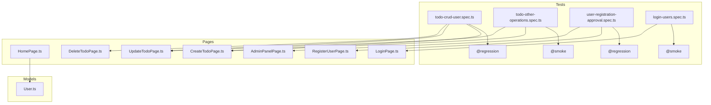
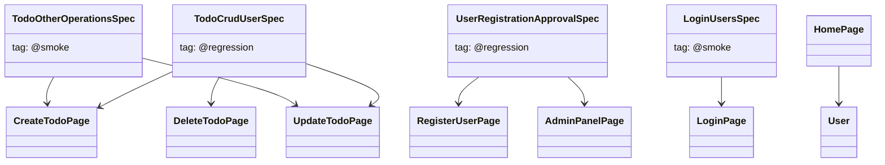

# Test Flow Diagram

**Diagram notes:**
- "CRUD," registration, and login spec files cover most front-end test flows (parametrized using test-data/).
- Tags in test titles allow `--grep` filtering (e.g., `@smoke`, `@regression`).
- All tests now run successfully across desktop, tablet, and mobile viewports.

## UML Class Diagram

**UML notes:**
- Each `Spec` class represents a test file and can use tags in titles for CI/test filtering.
- Arrow direction indicates main test-to-POM/model interactions.

_Both diagrams use Mermaid syntax, compatible with GitHub preview and VS Code extensions._
