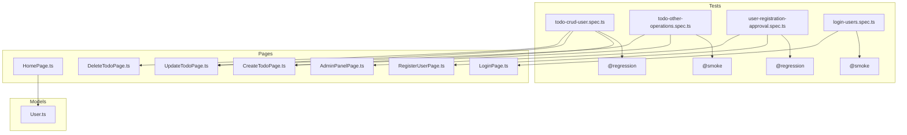
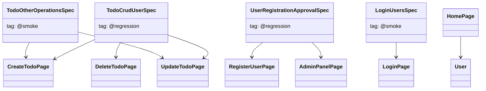
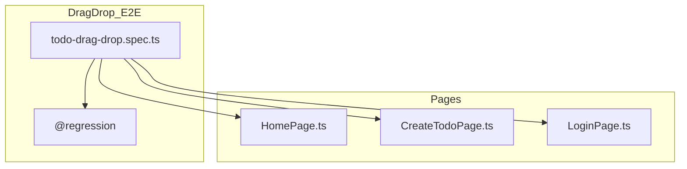

# Test Flow Diagram


```mermaid
flowchart TD
    subgraph Tests
        crud["todo-crud-user.spec.ts"]
        others["todo-other-operations.spec.ts"]
        reg["user-registration-approval.spec.ts"]
        login["login-users.spec.ts"]
        crudTag["@regression"]
        othersTag["@smoke"]
        regTag["@regression"]
        loginTag["@smoke"]
        crud --> crudTag
        others --> othersTag
        reg --> regTag
        login --> loginTag
    end

    subgraph Pages
        homePage["HomePage.ts"]
        createTodoPage["CreateTodoPage.ts"]
        updateTodoPage["UpdateTodoPage.ts"]
        deleteTodoPage["DeleteTodoPage.ts"]
        loginPage["LoginPage.ts"]
        registerUserPage["RegisterUserPage.ts"]
        adminPanelPage["AdminPanelPage.ts"]
    end

    subgraph Models
    User["User.ts"]
    end

    crud --> createTodoPage
    crud --> updateTodoPage
    crud --> deleteTodoPage
    others --> createTodoPage
    others --> updateTodoPage
    reg --> registerUserPage
    reg --> adminPanelPage
    login --> loginPage
    homePage --> User
```

**Diagram notes:**
- "CRUD," registration, and login spec files cover most front-end test flows (parametrized using test-data/).
- Tags in test titles allow `--grep` filtering (e.g., `@smoke`, `@regression`).
- All tests now run successfully across desktop, tablet, and mobile viewports.

## UML Class Diagram


```mermaid
classDiagram
    class TodoCrudUserSpec {
      tag: @regression
    }
    class TodoOtherOperationsSpec {
      tag: @smoke
    }
    class UserRegistrationApprovalSpec {
      tag: @regression
    }
    class LoginUsersSpec {
      tag: @smoke
    }
    class HomePage
    class CreateTodoPage
    class UpdateTodoPage
    class DeleteTodoPage
    class LoginPage
    class RegisterUserPage
    class AdminPanelPage
    class User

    TodoCrudUserSpec --> CreateTodoPage
    TodoCrudUserSpec --> UpdateTodoPage
    TodoCrudUserSpec --> DeleteTodoPage
    TodoOtherOperationsSpec --> CreateTodoPage
    TodoOtherOperationsSpec --> UpdateTodoPage
    UserRegistrationApprovalSpec --> RegisterUserPage
    UserRegistrationApprovalSpec --> AdminPanelPage
    LoginUsersSpec --> LoginPage
    HomePage --> User
```

**UML notes:**
- Each `Spec` class represents a test file and can use tags in titles for CI/test filtering.
- Arrow direction indicates main test-to-POM/model interactions.

_Both diagrams use Mermaid syntax, compatible with GitHub preview and VS Code extensions._

## Drag & Drop E2E Test Diagram


```mermaid
flowchart TD
    subgraph DragDrop_E2E
        drag["todo-drag-drop.spec.ts"]
        dragTag["@regression"]
        drag --> dragTag
    end

    subgraph Pages
        homePage["HomePage.ts"]
        createTodoPage["CreateTodoPage.ts"]
        loginPage["LoginPage.ts"]
    end

    drag --> loginPage
    drag --> createTodoPage
    drag --> homePage
```

- The drag-and-drop spec logs in, creates two todos using `CreateTodoPage`, then reorders rows on the list using `HomePage`.
- Tests rely on the displayed title returned by `CreateTodoPage.createTodoFromModel(...)` because the backend appends a timestamp suffix to titles.
- HTML5 drag-and-drop is performed using `locator.dragTo`, and the test waits for `PUT /api/todos/reorder` to confirm persistence.

## Headed Debug Quickstart

- Windows (Batch):
```
bat-scripts\run_playwright_tests.bat --headed --project=ui ui-tests\todo-drag-drop.spec.ts -g "should drag and drop to reorder todos and verify new order"
```

- Mac/Linux (Shell):
```
bash sh-scripts/run_playwright_tests.sh --headed --project=ui ui-tests/todo-drag-drop.spec.ts -g "should drag and drop to reorder todos and verify new order"
```
